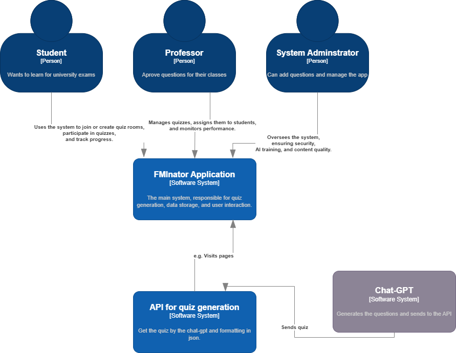
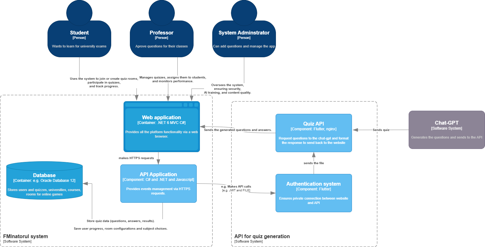
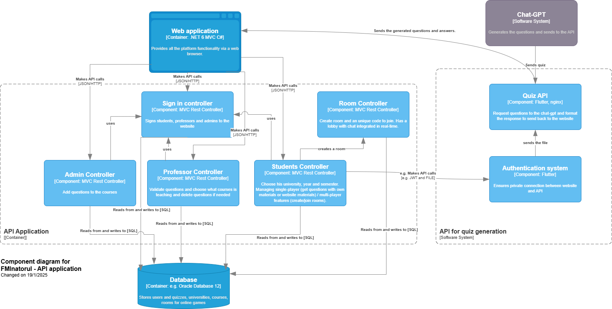
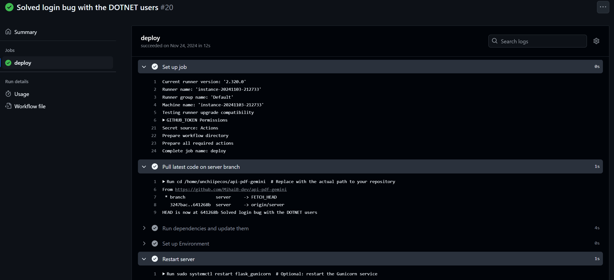
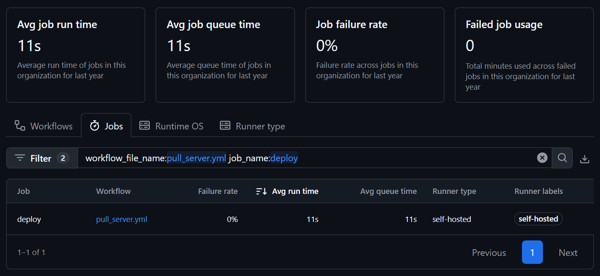
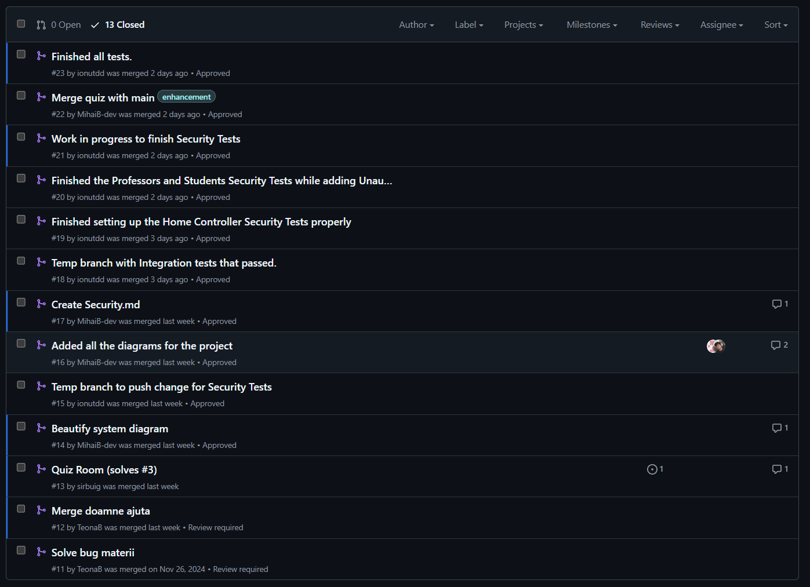

# Inginerie Software

Demo Video MDS (iunie 2024): https://drive.google.com/drive/folders/1xtdYpRfc5MC_he19hkcUQl3Nkel8XM9g

## Secondary Github repository for AI-API
https://github.com/MihaiB-dev/api-pdf-gemini

## Product Vision

`FOR` students in various specializations   
`WHO` need efficient learning tools and collaboration opportunities   

**The FMInatorul** is a web-based educational platform   
`THAT` generates personalized quizzes from study materials, provides feedback, and allows peer communication   
`UNLIKE` traditional study apps that only offer static content or generic quizzes   
`OUR PRODUCT` uses AI to generate dynamic quizzes based on uploaded PDFs,
allows subject-specific quiz participation, 
and supports collaborative learning in virtual rooms with real-time interactions.

## User problem and solution

For the app we've prepared [user personas](Backlog/User-personas.md) with [user stories](Backlog/User-Stories.md) and some [scenarios](Backlog/Scenarios.md) for a better understanding of the problem we are trying to solve. 

This is a short summary:

`Problem: Overwhelming and Ineffective study resources: `

Students like Mirel, who prefer quick and easy study methods, and Bursarescu, who seek advanced learning tools, face challenges with traditional resources. Mirel struggles with long, dense materials, while Bursarescu finds standard resources too basic.

`Solution: Personalized and Interactive Learning: `  

Our app uses AI to generate personalized quizzes from PDFs, breaking content into manageable sections for Mirel and offering specialization-focused quizzes for Bursarescu. Collaborative quiz rooms provide an engaging way for students to learn with peers, enhancing motivation and retention.

## Architecture

#### System Design

#### Container Diagram

#### Component Diagram

There are other diagrams such as : [flowchart](Backlog/Flowchart.png), [database diagram](Backlog/Old-Data/Database-Diagram.jpeg) and [UML diagram](Backlog/Old-Data/UML-Diagram.png).

## Product features

- [x] **AI-Generated Quizzes:** Automatically generate a 10-question quiz from uploaded PDFs, customized to the content of the document.

- [x] **Chat Functionality:** Enable real-time communication between students via a built-in chat, allowing collaboration and discussion.

- [x] **Preloaded Quizzes:** Allow users to choose from a database of pre-existing quizzes, organized by subject, managed by Admins and Professors.

- [x] **References/Links for Study Material:** Provide external references and links related to the quiz questions to enhance learning.

- [x] **Specialization Customization:** Support multiple specializations, adapting quizzes and content to different fields of study.

- [x] **API Security System:** Restrict quiz generation API access to registered users, ensuring only authorized individuals can use the feature

- [x] **Feedback System:** Provide feedback at the end of each quiz, indicating which answers were correct and which were incorrect.

- [ ] (50%) **PDF Sectional Quiz Generation:** Split uploaded PDFs into sections and generate specific questions for each section.

- [ ] (50%) **Collaborative Quiz Rooms:** Create virtual rooms where students can participate in quizzes together in real-time.

- [ ] **Error Tracking:** Centralize incorrect answers across quizzes and allow users to review them for a better understanding of the course.

## Non-functional architecture tasks:

- Encrypt sensitive data, such as user progress, quiz generation, file transfer and quiz results, both in transit using HTTPS and at rest.

- Prevent unauthorized access to quiz-generation APIs by requiring secure API tokens.

- Document API endpoints for external integrations with university systems or learning management platforms (we used swagger for documentation).

- Optimize the UI for both mobile and desktop platforms to accommodate students studying on the go.

- Support pdf files up to 300 pages for hardcore courses.

- Monitor cloud service costs (storage and compute).

- Use role-based policies to define permissions for actions like generating quizzes, viewing student data, or accessing admin dashboards.

-  Restrict frontend UI components and routes based on roles (Hide admin-only features for students).

## QA

#### I QA Objectives

Created automated testing for the following:

- The file upload process.
- The quiz generation logic.
- The handling of user roles and permissions.

All tests aim to validate the correct functionality of the UploadPdf method in the StudentsController by ensuring that PDF files are uploaded and processed correctly, quizzes are generated, and questions and answers are populated accurately.
Tested permissions, and verified that the system properly handles permission-related cases, where unauthorized users (e.g., students) cannot access restricted actions (e.g., editing professor details).

#### II The testing process

1) Requirements Phase

Conducted Validation Testing to confirm functional requirements, such as quiz generation accuracy and results accuracy, and system constraints.

2) Design Phase

Analyzed the design of controllers, authentication, and database interaction.

3) Implementation Phase

Applied Unit Testing to verify individual methods (e.g., UploadPdf).
Wrote mock-based tests for services like UserManager and file uploads.

4) Integration Phase

Used Integration Testing to validate the flow between the Authentication Service, Database, and the core AI module.

5) System Testing

Conducted End-to-End Testing to ensure seamless user journeys for professors and students.

#### III Testing Methods

1) Unit Testing 

- Validated individual components like StudentsController, methods like UploadPdf, and their logic.
- Verified correct interaction with services such as UserManager, SignInManager, and the database.

2) Integration Testing

- Ensured components work together correctly (e.g., controllers interacting with services and the database).
- Validated the interaction between the Authentication Service and user roles (Student, Professor).

3) System Testing

- Tested the system flow (e.g., uploading a PDF, extracting quiz questions, and quizzes have right answers).

4) Security Testing

- Authentication required for different parts of the application, and we get forbidden if we try different things
that he doesn't have authorization.

5) Validation Testing

-  Ensured alignment with business requirements, such as quiz generation accuracy and results accuracy.

#### IV Results of testing 

Preliminary Observations:

1) Unit Testing

- Confirmed proper file handling in UploadPdf.
- Verified that quizzes have valid questions and answers.
- Detected edge cases (e.g., non-PDF uploads, empty files).

2) Integration Testing

- Verified no potential issues in how the Authentication Service handles session persistence for both roles.

3) System Testing

- The system flow works as intended.

4) Security Testing

Detected and removed gaps in unauthorized access.

5) Validation Testing

AI-based quiz generation meets basic accuracy and doesn't require further optimization to reduce errors in question extraction.

## Security Analysis

The app is divided into two components: the website, which contains most of the application's functionality, and the web service (an in-house API) hosted at https://api.fminatorul.xyz using Nginx. This API is responsible for generating quizzes using AI.

We have carefully considered `security measures` for both components.

#### API:
A secure HTTPS connection is established between the API and the website, ensuring all traffic is encrypted. This is achieved by hosting the API behind an Nginx server on Google Cloud.
JSON Web Tokens (JWT) are used for authentication between the API and the website. This ensures that only our services can access the API.
API testing is secured with a login mechanism that requires a username and password.
When the website connects to the API, a short-lived JWT with a 1-minute expiration is created. This ensures the API is used only for the specific task at hand and reduces the risk of misuse.

#### Website:
The app supports three types of users: Admin, Student, and Professor. Each role has specific privileges and access restrictions. Users cannot access features outside their assigned role.
User registration is limited to email domains such as s.unibuc.ro (students) or unibuc.ro (professors), ensuring only authorized individuals can create accounts.
Comprehensive tests have been implemented for all controller endpoints to ensure users can only access the features permitted for their roles.

## CI/CD

We used github infrastrcture for most of our CI/CD.  

We've hosted the API on the web : https://api.fminatorul.xyz using `Google Cloud`, `Flask`, `Nginx` and `Guniconrd`. 

- For an easy relocation of the app, we've created a simple `.sh` file that configurates all the server with our settings and starts it automatically. See those files : [google connection setup](https://github.com/MihaiB-dev/api-pdf-gemini/blob/server/setup_google.sh) and [flask and nginx setup](https://github.com/MihaiB-dev/api-pdf-gemini/blob/server/setup_flask_nginx.sh) 

- Moreover, we've connected the server with github action. When the server branch is changed, the server is updated with the new code. The `deployment latency` is 20 seconds.

For the Main-app we used rules for the main branch and we did a pull-request and approved each time we tried to push on this branch (minimum of 1 approval), thus we have a code ready for release.

Here is a part of our tree branch history:

## Maintenance 

We use google cloud for storing the AI-API, thus we pay monthly for a VPS with 2 GB RAM. Moreover, we use google cloud
bucket for managing files sent between GEMINI AI and our API. 

The costs of running the app resumes to that of the API. 